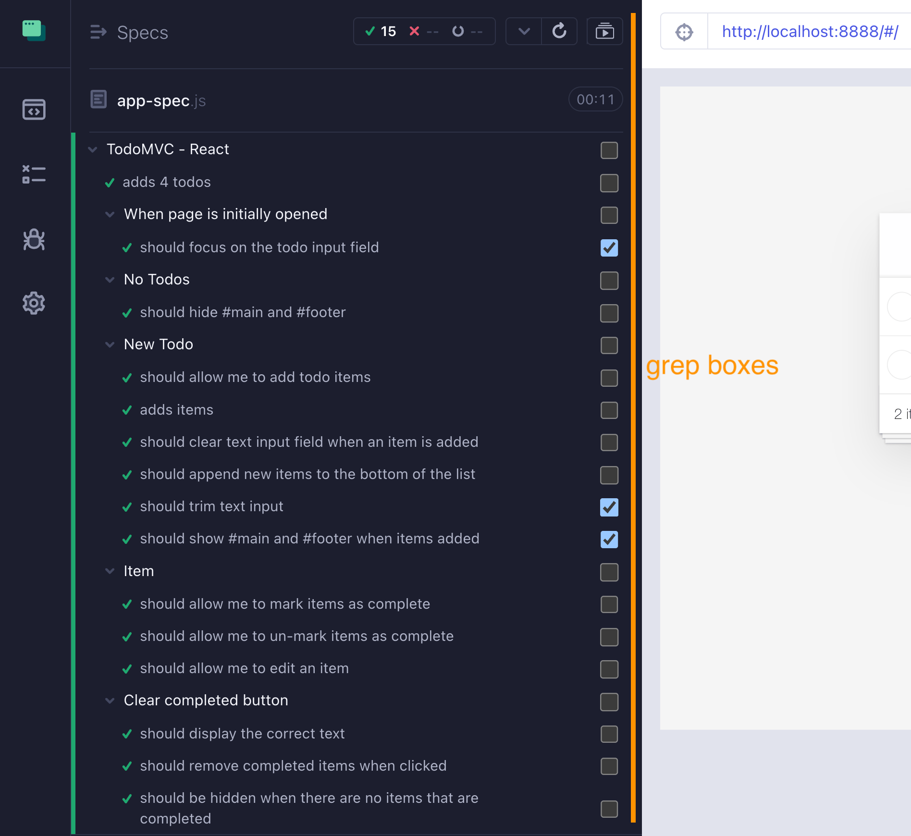

# cypress-grep-example

[](https://github.com/bahmutov/cypress-grep-example/actions/workflows/main.yml) [](https://github.com/bahmutov/cypress-grep-example/actions/workflows/badges.yml)
[](https://dashboard.cypress.io/projects/4agux9/runs)

[![renovate-app badge][renovate-badge]][renovate-app]  

> Example application with grep tags inside the test names

The demo example for the [@bahmutov/cy-grep](https://github.com/bahmutov/cy-grep) plugin.

Watch the video [intro to cypress-grep](https://www.youtube.com/watch?v=HS-Px-Sghd8) which shows how this repository tags tests, uses [@bahmutov/cy-grep](https://github.com/bahmutov/cy-grep) plugin, and sets up the TypeScript intelligent code completion.

You can also watch [How I organize pull request workflows](https://youtu.be/SFW7Ecj5TNE) where I show how the GitHub workflows in [.github/workflows](./.github/workflows) are organized to run the smoke tests first on pull request.

Read the blog post [Trigger Selected Cypress Specs Using GitHub Actions](https://glebbahmutov.com/blog/trigger-cypress-specs/)

## Install and start the app

Before filtering by test title and tag, we need to install dependencies and start the application

```shell
$ npm install
$ npm start
```

## Running tests by title

We can pick some tests to run using part of their title.

```shell
$ npx cypress run --env grep="the current number of todo items"
```

Runs just a single test found in [cypress/integration/counter-spec.js](./cypress/integration/counter-spec.js). The rest of the tests are still loaded, but are marked pending. To really target specific tests, add `--spec ...` argument

```shell
$ npx cypress run --env grep="the current number of todo items" \
  --spec cypress/integration/counter-spec.js
```

## Running tests by tag

Some tests in this repo in the [cypress/integration](./cypress/integration) folder have the tag `@smoke` in their config object. The symbol `@` has no meaning, I just like to use this prefix to make tags searchable.

```js
// cypress/integration/routing-spec.js
describe('TodoMVC - React', function () {
  context('Routing', function () {
    // other tests

    it('should allow me to display all items', { tags: '@smoke' }, function () {
      ...
    })

    // if you have more than one tag, use an array
    it('should respect the back button', { tags: ['@smoke'] }, function () {
      ...
    })
  })
})
```

To run just the tests with substring `@smoke` you can do:

```text
$ npx cypress run --env grepTag=@smoke
cypress-grep: filtering using tag "@smoke"
```

See the [.github/workflows/main.yml](./.github/workflows/main.yml) that first runs the smoke tests and then all the tests during the CI run. You can see the runs in the [repo's Actions tab](https://github.com/bahmutov/cypress-grep-example/actions).

## Repeat and burn tests

You can run the selected tests multiple times by using the `burn=N` parameter. For example, run all all the tests in the spec A five times using:

```text
$ npx cypress run --env burn=5 --spec cypress/integration/A.js
# run the smoke tests 3 times
$ npx cypress run --env grepTag=@smoke,burn=3
```

## Upgrade to Cypress v10

See the pull request [#79](https://github.com/bahmutov/cypress-grep-example/pull/79) that updates this repo to use Cypress v10

## Print test names

To see the test names and their tags, run `npm run print-tests` which uses [find-cypress-specs](https://github.com/bahmutov/find-cypress-specs).

## Select tests to run from the command line

You can use the included [dennisbergevin/cypress-cli-select](https://github.com/dennisbergevin/cypress-cli-select) to manually select the tests / tags / specs to run

```
$ npx cypress-cli-select run

 Cypress-cli-select

? Choose to filter by specs, specific test titles or tags:
  (Press <tab> to select/deselect, <ctrl> + <a> to toggle all, <enter> to proceed)
>[ ] Specs
 [ ] Test titles or tags (requires cy-grep)
```

📺 watch the video [Intro To The cypress-cli-select Plugin](https://youtu.be/lnehIEzJhlI).

## Grep boxes

This project includes [cypress-plugin-grep-boxes](https://github.com/dennisbergevin/cypress-plugin-grep-boxes) plugin to allow filtering the tests to run in the `cypress open` mode



📺 watch the video [cypress-plugin-grep-boxes Plugin Demo](https://youtu.be/u66poGcpyyQ)

## Small print

Author: Gleb Bahmutov &lt;gleb.bahmutov@gmail.com&gt; &copy; 2021

- [@bahmutov](https://twitter.com/bahmutov)
- [glebbahmutov.com](https://glebbahmutov.com)
- [blog](https://glebbahmutov.com/blog)
- [videos](https://www.youtube.com/glebbahmutov)
- [presentations](https://slides.com/bahmutov)
- [cypress.tips](https://cypress.tips)
- 🎓 [My Cypress courses](https://cypress.tips/courses)

License: MIT - do anything with the code, but don't blame me if it does not work.

[renovate-badge]: https://img.shields.io/badge/renovate-app-blue.svg
[renovate-app]: https://renovateapp.com/
